# Didim 시스템 아키텍처

## 전체 구성도

```mermaid
graph TB
    %% ────────────────────────────────
    %% Client
    %% ────────────────────────────────
    subgraph Client["🖥️ 클라이언트 (Browser)"]
        direction TB
        FE["Next.js 15 App\n(wedidim.com · Vercel)"]
        MW["Next.js Middleware\nJWT 검증 / 자동 Refresh"]
        Webcam["웹캠 · 마이크\nMediaRecorder API"]
        HumanLib["@vladmandic/human\n얼굴 감지 (웹캠)"]
        Jotai["Jotai\n전역 상태 관리"]
    end

    %% ────────────────────────────────
    %% CDN / Edge
    %% ────────────────────────────────
    CF["☁️ Cloudflare\n(CDN + SSL)"]

    %% ────────────────────────────────
    %% Backend Infra
    %% ────────────────────────────────
    subgraph Infra["🐳 백엔드 인프라 (Docker Compose · OCI ARM64)"]
        direction TB

        Nginx["🔀 Nginx\n리버스 프록시 · SSL 종료\n:80 → :443\n/ → NestJS  |  /ml/ → Flask"]

        subgraph NestApp["NestJS API Server (interview · :8000)"]
            direction LR
            AuthMod["Auth Module\nGoogle OAuth2\nJWT (access 2h / refresh 7d)"]
            UserMod["User Module\nOCI Oracle DB CRUD"]
            GenQ["GenerateQuestion Module\nLangChain Pipeline\nSSE 스트리밍 질문 생성"]
            Session["Interview Session Module\n세션 생성 · 조회 · 관리"]
            Answer["Interview Answer Module\n답변 저장 · 조회"]
            Followup["Followup Module\n꼬리질문 생성 (OpenAI)"]
            Transcribe["Transcribe Module\n음성 → 텍스트\n(OpenAI Whisper)"]
            Analysis["Analysis Module\nBullMQ Worker\n답변 분석 · SSE 결과 Push"]
            ExtSvc["ExternalServer Module\nFlask 통신 · OCI Storage\nRedis · Weaviate 연결"]
            OpenAISvc["OpenAI Module\nChatGPT Service\nWhisper Service\nEmbedding Service"]
        end

        subgraph MLApp["Python Flask ML Server (ml-server · :5000)"]
            direction LR
            ConvAPI["POST /convert_seekable\nwebm → Seekable webm\n(ffmpeg)"]
            ExtAPI["POST /extract_text\nPDF → Markdown\n(PyMuPDF · pymupdf4llm)"]
            AnaAPI["POST /analyze\n음성 Filler Word 분석\n(TensorFlow 모델)"]
        end

        Redis["🟥 Redis\nBullMQ 큐 브로커"]
    end

    %% ────────────────────────────────
    %% External Cloud Services
    %% ────────────────────────────────
    subgraph Ext["☁️ 외부 클라우드 서비스"]
        direction LR
        Google["Google OAuth2\n소셜 로그인"]
        OracleDB["Oracle DB (OCI)\n유저 · 세션 · 답변 · 분석 결과"]
        OCIStorage["OCI Object Storage\n음성 파일 (webm)\nPresigned URL 발급"]
        Weaviate["Weaviate Cloud\n벡터 스토어\n이력서 · JD 임베딩 검색"]
        OpenAI["OpenAI API\nGPT-4o · Whisper\ntext-embedding-3-small"]
    end

    %% ────────────────────────────────
    %% CI/CD & Monitoring
    %% ────────────────────────────────
    subgraph CICD["⚙️ DevOps"]
        GHA["GitHub Actions\nCI 파이프라인"]
        DockerHub["Docker Hub\n1201q/interview\n1201q/ml-server"]
        Vercel["Vercel\nFE 배포 · Analytics\nSpeed Insights"]
    end

    %% ────────────────────────────────
    %% Edges
    %% ────────────────────────────────
    FE -->|"HTTPS 요청"| CF
    CF -->|"SSL (Origin Cert)"| Nginx

    Nginx -->|":8000"| NestApp
    Nginx -->|":5000"| MLApp

    %% Auth flow
    FE -->|"GET /auth/google"| AuthMod
    AuthMod <-->|"OAuth2"| Google
    AuthMod -->|"HttpOnly Cookie\naccessToken / refreshToken"| FE
    MW -->|"POST /auth/refresh"| AuthMod

    %% Question generation
    FE -->|"PDF 업로드\n(이력서 · JD)"| ExtAPI
    ExtAPI -->|"추출된 텍스트"| GenQ
    GenQ -->|"텍스트 임베딩"| Weaviate
    GenQ -->|"SSE 스트리밍"| FE
    GenQ <-->|"GPT-4o (질문 생성)"| OpenAI

    %% Interview session
    FE -->|"세션 생성 요청"| Session
    Session -->|"R/W"| OracleDB
    Webcam -->|"webm 오디오 청크"| Transcribe
    Transcribe <-->|"Whisper API"| OpenAI
    Transcribe -->|"텍스트 STT 결과"| FE
    Answer -->|"R/W"| OracleDB

    %% Audio storage & analysis
    Webcam -->|"webm 변환"| ConvAPI
    ConvAPI -->|"Seekable webm"| OCIStorage
    Analysis -->|"Presigned URL → /analyze"| AnaAPI
    AnaAPI -->|"Filler word 통계"| Analysis
    Analysis <-->|"GPT 답변 분석"| OpenAI
    Analysis -->|"RAG: 유사 이력서/JD 검색"| Weaviate
    Analysis -->|"BullMQ 큐"| Redis
    Analysis -->|"결과 저장"| OracleDB
    Analysis -->|"SSE 실시간 진행률"| FE

    %% External Service connections
    ExtSvc --> OracleDB
    ExtSvc --> OCIStorage
    ExtSvc --> Weaviate
    ExtSvc --> MLApp

    %% CI/CD
    GHA -->|"Docker build & push"| DockerHub
    DockerHub -->|"image pull"| Infra
    GHA -->|"trigger deploy"| Vercel
```



---

## 컴포넌트 상세

### 프론트엔드 (didim-fe)

| 항목 | 내용 |
|------|------|
| 프레임워크 | Next.js 15 (App Router, Turbopack) |
| 배포 | Vercel |
| 상태 관리 | Jotai |
| 스트리밍 | RxJS + SSE (useStableSSE 훅) |
| 얼굴 감지 | @vladmandic/human (웹캠 실시간) |
| 파일 저장 | @vercel/blob |
| 인증 | HttpOnly 쿠키 (middleware.ts에서 자동 refresh) |

**페이지 구조 (App Router)**

```
app/
├── (landing)/          # 랜딩 페이지
├── (login)/            # 로그인 (Google OAuth 리다이렉트)
├── @modal/             # Intercepting Routes 모달
├── new-request/        # 면접 요청 생성 (이력서/JD 업로드)
├── interview/          # 면접 진행 (웹캠 + STT + 질문 표시)
├── feedback/           # 피드백 결과 (차트 · 분석)
└── history/            # 면접 기록
```

---

### 백엔드 (didim-be · NestJS)

| 모듈 | 역할 |
|------|------|
| **AuthModule** | Google OAuth2 로그인, JWT 발급 (access 2h / refresh 7d), 쿠키 관리 |
| **UserModule** | Oracle DB 유저 CRUD |
| **GenerateQuestionModule** | 이력서·JD 기반 LangChain 파이프라인으로 질문 생성, SSE 스트리밍 |
| **InterviewSessionModule** | 면접 세션 생성·조회·상태 관리 |
| **InterviewAnswerModule** | 답변 저장·조회 |
| **FollowupModule** | GPT 기반 꼬리질문 생성 |
| **TranscribeModule** | OpenAI Whisper를 통한 음성→텍스트 변환 |
| **AnalysisModule** | BullMQ Worker로 비동기 분석 처리, SSE로 진행률 Push |
| **ExternalServerModule** | Flask 서버 · OCI Object Storage · Redis · Weaviate 어댑터 |
| **OpenAIModule** | ChatGPT / Whisper / Embedding 공유 서비스 |

---

### ML 서버 (ml-server · Python Flask)

| 엔드포인트 | 역할 |
|-----------|------|
| `POST /convert_seekable` | 브라우저 webm → Seekable webm (ffmpeg 변환) |
| `POST /extract_text` | PDF → Markdown 텍스트 추출 (PyMuPDF, pymupdf4llm) |
| `POST /analyze` | 음성 Filler Word 분석 (TensorFlow 커스텀 모델) |

---

### 인프라 (Docker Compose · OCI ARM64)

```
docker-compose.yml
├── nginx          → :80/:443, SSL, 리버스 프록시
├── app (NestJS)   → :8000 (내부), 이미지: 1201q/interview
├── ml-server      → :5000 (내부), 이미지: 1201q/ml-server
└── redis          → BullMQ 브로커
```

**Nginx 라우팅 규칙**

| 경로 | 대상 |
|------|------|
| `api.wedidim.com/` | `interview:8000` (NestJS, WebSocket Upgrade 포함) |
| `api.wedidim.com/ml/` | `ml-server:5000` (Flask) |

---

### 외부 클라우드 서비스

| 서비스 | 용도 |
|--------|------|
| **Oracle DB (OCI)** | 유저, 세션, 답변, 분석 결과 영구 저장 |
| **OCI Object Storage** | 녹음 음성 파일(webm) 보관, Presigned URL로 ML 서버 접근 |
| **Weaviate Cloud** | 이력서·JD 청크 임베딩 저장, RAG 유사도 검색 |
| **OpenAI API** | GPT-4o (질문 생성·분석·꼬리질문), Whisper (STT), text-embedding-3-small |
| **Google OAuth2** | 소셜 로그인 |
| **Cloudflare** | CDN, DDoS 방어, SSL Origin Certificate |
| **Vercel** | FE 배포, Analytics, Speed Insights, Blob Storage |

---

## 주요 데이터 흐름

### 1. 로그인 플로우
```
User → /auth/google → Google OAuth2 → /auth/google/callback
     → JWT 발급 → HttpOnly Cookie(accessToken 2h, refreshToken 7d) → 메인 페이지
```

### 2. 면접 요청 · 질문 생성 플로우
```
User → 이력서(PDF) + JD 업로드
     → ML Server /extract_text → Markdown 텍스트
     → NestJS GenerateQuestion
         → Weaviate에 임베딩 저장
         → LangChain + GPT-4o로 질문 생성
         → SSE 스트리밍 → FE 실시간 표시
```

### 3. 면접 진행 플로우
```
WebCam/Mic → MediaRecorder(webm 청크)
           → ML Server /convert_seekable → Seekable webm → OCI Object Storage
           → NestJS /transcribe → OpenAI Whisper → STT 텍스트 → FE 표시
           → 답변 Oracle DB 저장
```

### 4. 분석 플로우
```
면접 종료 → NestJS Analysis Controller
          → BullMQ 큐(Redis)에 분석 Job 등록
          → Analysis Worker:
              ├── OCI Presigned URL → ML Server /analyze → Filler Word 통계
              ├── Weaviate RAG 검색 (이력서·JD 유사 청크)
              └── GPT-4o 답변 텍스트 분석
          → Oracle DB 결과 저장
          → SSE 진행률 Push → FE 실시간 업데이트
```
